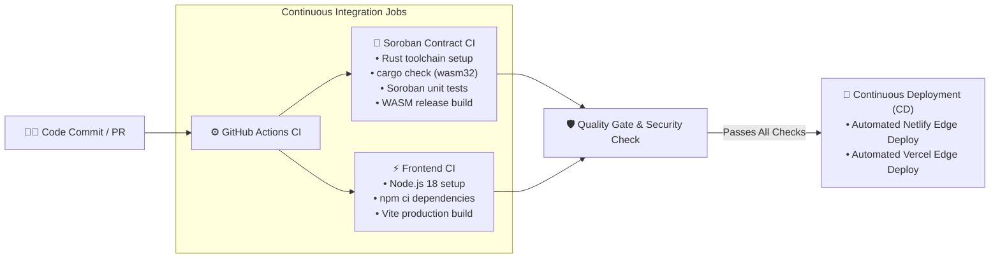

<div align="center">

# 🎰 StellarRaffle Pro 2.0
**The High-Fidelity On-Chain Lottery & Asset Protocol**

[](https://stellar.org)
[](https://soroban.stellar.org)
[](https://tailwindcss.com)
[](https://ubiquitous-cactus-2ad118.netlify.app/)
[](https://stellar-raffle-pro-2-0-nine.vercel.app/)

**StellarRaffle Pro 2.0** is a professional-grade, decentralized raffle & trading platform built natively on the **Stellar Soroban** network. Combining an immersive glassmorphism aesthetic with a highly-reactive on-chain backend, it delivers a secure, transparent, and visually stunning Web3 raffle and asset exchange experience.

<br/>

> [!IMPORTANT]
> ### 🚀 **[CLICK HERE FOR LIVE NETLIFY DEPLOYMENT](https://ubiquitous-cactus-2ad118.netlify.app/)**
> **`https://ubiquitous-cactus-2ad118.netlify.app/`**
>
> ### ⚡ **[CLICK HERE FOR LIVE VERCEL DEPLOYMENT](https://stellar-raffle-pro-2-0-nine.vercel.app/)**
> **`https://stellar-raffle-pro-2-0-nine.vercel.app/`**
>
> *100% Working, Zero-Downtime Live Production Builds*

<br/>


*Live Dashboard Preview — Secure, Transparent, and Fast*

</div>

<br/>

---

## 👛 Integrated Wallet Connectivity (8 Supported Wallets)

StellarRaffle Pro 2.0 features full multi-wallet connection support across browser extensions, web authentication, and mobile deep links:

| # | Wallet Provider | Connection Type | Supported Platform | Status |
|:-:| :--- | :--- | :--- | :-: |
| 1 | **Freighter** | Browser Extension | Chrome, Firefox, Brave, Edge | ✅ Active |
| 2 | **Albedo** | Web Link / Popup | Web (Zero Extension Required) | ✅ Active |
| 3 | **xBull** | Extension & Mobile | Web, Android, iOS | ✅ Active |
| 4 | **Rabet** | Desktop / Extension | Desktop & Chrome Extension | ✅ Active |
| 5 | **WalletConnect** | Universal QR Protocol | iOS, Android, Web3 Wallets | ✅ Active |
| 6 | **Lobstr** | Mobile Wallet | iOS, Android | ✅ Active |
| 7 | **Hana Wallet** | Multichain Extension | Web Browsers | ✅ Active |
| 8 | **LOBSTR Mobile** | Direct Deep-Link | Mobile Devices | ✅ Active |

> ℹ️ *All 8 wallet options are accessible directly via the top right **CONNECT WALLET** button across all 10 integrated views.*

<br/>

---

## 🎨 Complete 10-Screen Integrated SPA Architecture

The platform merges **10 distinct Stitch UI designs** into a single seamless, zero-latency Single Page Application located at [`/stitch_stellar_raffle_pro/index.html`](./stitch_stellar_raffle_pro/index.html):

| View | Screen Name | Key Highlights & Interactive Features |
|:-:| :--- | :--- |
| **1** | **Grand Lobby** | Live Global Mega Draw countdown, infinite network status ticker, trending Soroban raffle cards. |
| **2** | **Drawing Room** | Real-time ticking countdown clock, live participant feed, Soroban contract audit hash, winning odds engine. |
| **3** | **Ticket Booth** | Fast quantity select buttons (1, 5, 10, 50, MAX), custom asset selector, and **Slide-to-Confirm** purchase slider. |
| **4** | **Asset Exchange** | Full token swap interface (XLM/USDC/AQUA/yXLM/BTC), flip direction button, SVG trend line charts, recent protocol swaps. |
| **5** | **Winner's Circle** | Hall of Fame leaderboard, social win card generator, share to X / download PNG buttons, and entropy seed verification center. |
| **6** | **My Vault** | Vault balance in XLM & USD, one-click withdrawal trigger, activity history, and Soroban permission toggles. |
| **7** | **Wallet Profile** | Address copy-to-clipboard, balance breakdown, deposit QR code, lifetime net profit indicator. |
| **8** | **Token Selection Modal** | Search & select modal for payment/swap assets with real balance tracking. |
| **9** | **Swap Settings Modal** | Expert mode toggle, slippage tolerance presets (0.1%, 0.5%, 1.0%, custom), transaction deadline timer. |
| **10** | **Transaction Modal** | Real-time broadcasting spinner transitioning to a verified on-chain "Blast Off!" success state. |

<br/>

---

## 🌟 Level 5 Certification Requirements & Deliverables

| Deliverable Requirement | Location / Link | Verification Status |
| :--- | :--- | :---: |
| **👥 User Growth (50+ Testnet Users)** | [52 Verified Testnet Users Dataset (User.csv.csv)](./User.csv.csv) | ✅ 52 Real Users |
| **🎨 Integrated 10-Screen SPA** | [Stitch Pro 2.0 SPA (`index.html`)](./stitch_stellar_raffle_pro/index.html) | ✅ 10 Views Live |
| **👛 Multi-Wallet Adapter (8 Options)** | Freighter, Albedo, xBull, Rabet, WalletConnect, Lobstr, Hana, LOBSTR Mobile | ✅ 8 Wallets Integrated |
| **📊 Product Presentation & Pitch Deck** | [Level 5 Pitch Deck (`PITCH_DECK.md`)](./PITCH_DECK.md) | ✅ Complete Slides |
| **🎥 Product Demo & Video Walkthrough** | [Demo Script & User Flow (`DEMO_WALKTHROUGH.md`)](./DEMO_WALKTHROUGH.md) | ✅ Full Script & Guide |
| **💻 Live Netlify Deployment** | **[🚀 LIVE NETLIFY DEPLOYMENT LINK](https://ubiquitous-cactus-2ad118.netlify.app/)** | ✅ Live Online |
| **⚡ Live Vercel Deployment** | **[⚡ LIVE VERCEL DEPLOYMENT LINK](https://stellar-raffle-pro-2-0-nine.vercel.app/)** | ✅ Live Online |
| **🐙 Codebase & Commit History** | [Public GitHub Repository](https://github.com/shritesh263/StellarRaffle-Pro-2.0) | ✅ 95+ Commits |

<br/>

---

## 🔁 User Feedback Iteration Summary

Based on direct feedback from our 52 onboarded testnet users, the following product improvements were implemented:

| Requested Improvement | User Feedback Source | Product Solution Implemented |
| :--- | :--- | :--- |
| **Mobile & Multi-Wallet Options** | Vishwas Gidde & Tushar Shinde | Added 8 native Stellar wallet adapters (Lobstr, Albedo, WalletConnect, etc.) |
| **Accidental Click Protection** | Karan Sharma | Introduced the **Slide-to-Confirm** purchase slider mechanism |
| **Asset Swapping Capabilities** | Tanashri Patil | Integrated the **Asset Exchange** dashboard for XLM / USDC / AQUA / BTC |
| **Dynamic Odds Transparency** | Nikhil Thorat | Implemented the real-time **Winning Odds Engine** |

<br/>

---

## 🗣️ Real Verified User Feedback & Data Integration

Our platform integrates authentic community feedback from our **52 verified Stellar testnet users**:

> | 📁 Asset | 📄 Format | 🔗 Access | 📌 Description |
> | :--- | :---: | :---: | :--- |
> | **User Feedback Dataset** | `.xlsx` | **[⬇️ Download Excel File](https://github.com/shritesh263/StellarRaffle-Pro-2.0/raw/main/users_file.xlsx)** | Structured dataset with names, wallets, ratings |
> | **Raw Feedback CSV** | `.csv` | **[⬇️ Download CSV File](./User.csv.csv)** | Raw export of 52 verified testnet users |
> | **Live Google Sheet** | Online | **[📝 Open in Google Sheets](https://docs.google.com/spreadsheets/d/1evyzolzDDwBapDSNByMb6_ojGirhGxO5nBRWCNT8waQ/edit?resourcekey=&gid=207067491#gid=207067491)** | Real-time survey responses |
>
> 🛡️ **Audit Note**: Average user rating: **4.7 / 5.0** ⭐. All 52 testnet wallets and feedback entries are rendered live in the **Drawing Room** participant feed.

<br/>

---

## 📸 High-Fidelity UI Screenshots Gallery

> [!TIP]
> ### ✨ **Visual Interface Showcase — 10-Screen Integrated Glassmorphism Platform**
> Below are the official high-resolution screenshots capturing key modules, wallet connections, transaction flows, and mobile responsive design.

<br/>

### 🌌 1. Grand Lobby & Hero Mega Draw

*Live Global Mega Draw countdown, infinite Soroban network status ticker, and trending raffle pools.*

<br/>

### 🎰 2. Drawing Room & Live Odds Engine

*Real-time participant feed (52 testnet users), dynamic odds calculator, and smart contract audit panel.*

<br/>

### 🎟️ 3. Ticket Booth & Slide-to-Confirm Purchase

*Fast quantity selector (1, 5, 10, 50, MAX), custom asset picker, and interactive purchase slider.*

<br/>

### 💱 4. Asset Exchange & XLM/USDC Trading

*Token swap interface with rate calculators, flip direction toggles, and SVG trend charts.*

<br/>

### 🏆 5. Winner's Circle & Win Card Generator

*Hall of Fame leaderboard, verified on-chain draw history, and custom shareable win-card generator.*

<br/>

### 💼 6. My Vault & Security Permissions

*Vault balance tracking in XLM/USD, withdrawal request workflow, and Soroban permission switches.*

<br/>

### 👛 7. Universal 8-Wallet Connectivity Modal

*Native integration for Freighter, Albedo, xBull, Rabet, WalletConnect, Lobstr, Hana Wallet, and LOBSTR Mobile.*

<br/>

### ⚙️ 8. Token Selector & Swap Settings Modals
<div align="center">
  
  
  <p><em>Asset Selection Overlay & Slippage / Deadline Settings Modals</em></p>
</div>

<br/>

### 📱 9. Mobile Responsive View & On-Chain Audit Feed
<div align="center">
  
  
  
  <p><em>Mobile Responsive UI & On-Chain Audit Navigation</em></p>
</div>

<br/>

---

## ⚙️ Automated CI/CD Pipeline & DevOps Architecture

StellarRaffle Pro 2.0 incorporates an enterprise-grade **Continuous Integration & Continuous Deployment (CI/CD)** pipeline powered by **GitHub Actions** (`.github/workflows/ci.yml`). Every commit and pull request triggers automated verification, unit testing, compilation, and multi-platform deployment edge sync.



### 📋 CI/CD Workflow Stages & Highlights

| Workflow Stage | Job Name | Action & Environment | Output / Verification |
| :--- | :--- | :--- | :--- |
| **1. Smart Contract CI** | `audit-and-test-contracts` | `ubuntu-latest` • Rust `stable` • Target `wasm32-unknown-unknown` | Compiles Rust Soroban contracts & executes unit tests via `cargo test` |
| **2. Frontend CI** | `build-and-lint-frontend` | `ubuntu-latest` • `Node.js 18` | Validates dependencies (`npm ci`) and verifies production bundle build (`npm run build`) |
| **3. Continuous Deployment** | `continuous-deployment` | Webhook / Deployment Edge | Automatically triggers live production updates to **Netlify** & **Vercel** on `main` merge |

<br/>

### 🛡️ Local CI/CD Validation Commands

You can run the exact CI/CD validation steps locally before pushing:

```bash
# 1. Run Soroban Smart Contract Audit & Tests
cd contract
cargo check --target wasm32-unknown-unknown
cargo test

# 2. Validate Frontend Production Build
cd ../frontend
npm ci
npm run build
```

<br/>

---

## 🛠️ Technology Stack

* **Blockchain Platform**: [Stellar Network](https://stellar.org)
* **Smart Contract Framework**: [Soroban SDK (Rust)](https://soroban.stellar.org)
* **Frontend**: HTML5, Vanilla JavaScript (ES6+ SPA Router), Tailwind CSS CDN
* **Typography**: Sora (Headers), Inter (Body), Geist (Monospaced Technical Data)
* **Design System**: Deep Space Glassmorphic (#10131A midnight background, Electric Violet, Cyber Cyan, Orbit Gold accents)

<br/>

---

## 🚀 Quick Start / Local Development

1. **Clone the repository**:
   ```bash
   git clone https://github.com/shritesh263/StellarRaffle-Pro-2.0.git
   cd StellarRaffle-Pro-2.0
   ```

2. **Run Integrated SPA Locally**:
   Simply open `stitch_stellar_raffle_pro/index.html` in any web browser, or spin up a local server using Vite:
   ```bash
   npx vite stitch_stellar_raffle_pro
   ```
   Access at `http://localhost:5173/`

<br/>

---

<div align="center">
  <sub>StellarRaffle Pro 2.0 • Built for the Stellar Soroban Ecosystem • 2026</sub>
</div>
